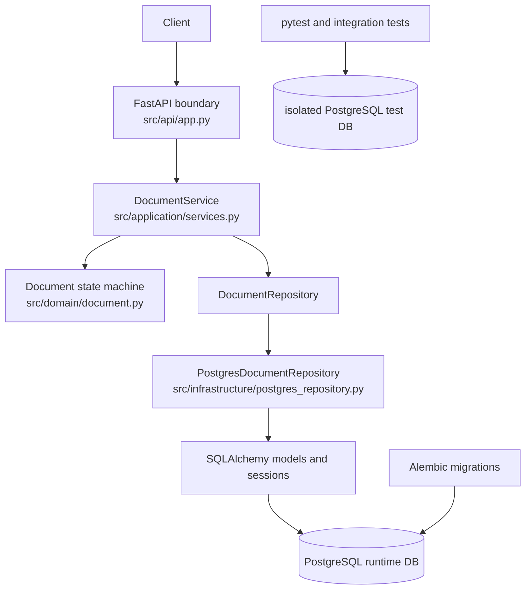

# document-service

A FastAPI/PostgreSQL service implementing a controlled document approval workflow, designed around explicit state transitions, idempotent creation, optimistic concurrency, explicit transaction boundaries, deterministic failure behavior, and migration-owned schema lifecycle.

- Python 3.12
- FastAPI
- PostgreSQL
- SQLAlchemy 2.x
- Alembic
- Docker Compose
- strict mypy
- CI-backed integration testing
- coverage gate >=95%

## Why This Service Exists

This repository is intentionally narrow. It focuses on correctness for stateful writes rather than feature breadth.

Document states:

```text
draft -> submitted -> approved
                  -> rejected
```

`approved` and `rejected` are terminal. The interesting parts of the implementation are the controls around how a document gets there: state-machine enforcement, conditional updates, idempotent creation, explicit persistence boundaries, and deterministic API errors.

## Architecture



- Dependency direction is `api -> application -> domain`.
- The domain model is framework-agnostic and owns state legality.
- Persistence is behind a repository abstraction, with the Postgres implementation enforcing a second version check at the database write.
- Alembic owns schema lifecycle for both runtime and test databases.
- Tests run against a separate Postgres instance and clean rows without dropping the migrated schema.

## Correctness Contracts

| Concern | Mechanism | Observable behavior |
| --- | --- | --- |
| State legality | Domain transition methods on `Document` | Illegal transitions return `400 illegal_transition` |
| Idempotent create | `Idempotency-Key` plus persisted request hash | Same key/body replays `201`; same key/different body returns `409` |
| Lost-update protection | `If-Match`, integer version, and repository-side `WHERE version = ...` guard | Stale version returns `409 version_conflict` |
| Explicit persistence boundaries | `session.begin()` in repository and idempotency persistence writes | Mutating writes are explicit, not implicit autocommit |
| Schema lifecycle | Alembic migrations plus a one-shot `migrate` service in Compose | `make up` migrates before the API starts |
| Readiness | Queries against both required tables | DB unavailable or missing schema returns `503 db_unavailable` |
| Test isolation | Dedicated `postgres-test` database plus row cleanup only | `make check` does not remove runtime tables or runtime data |

## API

| Method | Path | Purpose | Required headers |
| --- | --- | --- | --- |
| `POST` | `/documents` | Create a draft document | `Idempotency-Key` |
| `GET` | `/documents/{doc_id}` | Retrieve a document | none |
| `PUT` | `/documents/{doc_id}` | Update a draft document | `If-Match` |
| `POST` | `/documents/{doc_id}/submit` | Transition `draft -> submitted` | `If-Match` |
| `POST` | `/documents/{doc_id}/approve` | Transition `submitted -> approved` | `If-Match` |
| `POST` | `/documents/{doc_id}/reject` | Transition `submitted -> rejected` | `If-Match` |
| `GET` | `/health/live` | Liveness check | none |
| `GET` | `/health/ready` | Readiness check | none |

Generated API documentation is available at `http://127.0.0.1:8000/docs` after the service is running.

Create example:

```bash
curl -X POST http://127.0.0.1:8000/documents \
  -H 'Content-Type: application/json' \
  -H 'Idempotency-Key: create-doc-1' \
  -d '{"title":"Quarterly Report","content":"Initial draft"}'
```

Conditional mutation example:

```bash
DOC_ID="<id returned by POST /documents>"

curl -X PUT "http://127.0.0.1:8000/documents/$DOC_ID" \
  -H 'Content-Type: application/json' \
  -H 'If-Match: 0' \
  -d '{"title":"Quarterly Report v2","content":"Revised draft"}'
```

## Error Contract

Modeled application errors use this envelope:

```json
{
  "error": {
    "code": "...",
    "message": "..."
  }
}
```

| HTTP | `error.code` | When it appears |
| --- | --- | --- |
| `422` | `validation_error` | Request validation fails or domain validation fails |
| `400` | `illegal_transition` | A state transition is not legal in the current document state |
| `404` | `not_found` | The target document does not exist |
| `409` | `version_conflict` | `If-Match` does not match the current version |
| `409` | `idempotency_key_conflict` | An idempotency key is reused with a different request body |
| `503` | `db_unavailable` | Readiness fails because the database or required schema is unavailable |

## Running Locally

Preferred path:

```bash
make install
make up
```

`make up` produces a usable local stack:

1. runtime Postgres starts
2. Postgres health passes
3. Alembic migration succeeds
4. API starts

Health check:

```bash
curl http://127.0.0.1:8000/health/live
curl http://127.0.0.1:8000/health/ready
```

Stop the stack:

```bash
make down
```

The default runtime database is `document_service` on port `5433`. The dedicated test database is `document_service_test` on port `5434`.

## Validation

Normal engineering gate:

```bash
make check
```

`make check` runs:

- `ruff check src`
- `mypy src` in strict mode
- the full pytest suite against the dedicated test database
- Alembic upgrade of the test database before tests
- coverage enforcement at `>=95%`

v1.0.1 verification:

- 64 tests
- 98.07% coverage
- runtime document survived complete `make check` execution
- migration upgrade/downgrade verification

## Design Record

- [project_spec/SPEC_PACK.md](project_spec/SPEC_PACK.md) — behavioral contract and frozen scope
- [project_spec/TRADEOFFS.md](project_spec/TRADEOFFS.md) — rejected alternatives and intentional limits
- [project_spec/INTERVIEW_DEFENSE.md](project_spec/INTERVIEW_DEFENSE.md) — concise architecture-review rationale

The service was specified before implementation, and implementation changes were reconciled against that contract rather than documented ad hoc.

## Non-Goals

- authentication / RBAC
- background jobs
- notifications
- caching
- search
- event sourcing
- horizontal or distributed coordination

These are scope boundaries for a deliberately bounded service, not deferred roadmap promises.